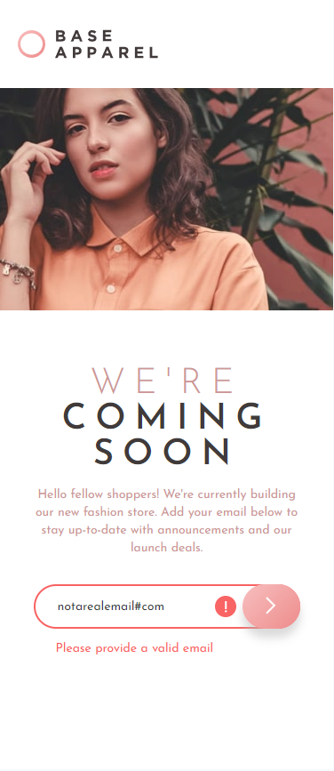

# Frontend Mentor - Base Apparel coming soon page solution

This is a solution to the [Base Apparel coming soon page challenge on Frontend Mentor](https://www.frontendmentor.io/challenges/base-apparel-coming-soon-page-5d46b47f8db8a7063f9331a0). Frontend Mentor challenges help you improve your coding skills by building realistic projects. 

## Table of contents

- [Overview](#overview)
  - [The challenge](#the-challenge)
  - [Screenshot](#screenshot)
  - [Links](#links)
- [My process](#my-process)
  - [Built with](#built-with)
  - [What I learned](#what-i-learned)
- [Author](#author)
- [Acknowledgments](#acknowledgments)

## Overview

### The challenge

Users should be able to:

- View the optimal layout for the site depending on their device's screen size
- See hover states for all interactive elements on the page
- Receive an error message when the `form` is submitted if:
  - The `input` field is empty
  - The email address is not formatted correctly

### Screenshot

## Desktop Design

## Desktop Active Design

## Mobile Active Design

### Links

- Live Site URL: [Base Apparel Coming Soon](https://rkendall300.github.io/base-apparel/)

## My process

### Built with

- Semantic HTML5 markup
- CSS custom properties
- Flexbox
- CSS Grid
- Mobile-first workflow
- [React](https://reactjs.org/) - JS library

### What I learned

This project had some growing pains, as I'm not familiar with using grid instead of flexbox for page styling. I tried to do it one way that included the margins on the desktop design for the info and base apparel logo, but that brought several problems into the mix with the background pattern not extending through the entire grid. I also had several problems with the background pattern itself because I completely missed the part of it that required a 135degree shift on the linear-gradient. Overall, this project was very frustrating for me to deal with, as I had to strip it down completely twice and start over. I'm happy with the way it turned out though.

## Author

- Frontend Mentor - [@rkendall300](https://www.frontendmentor.io/profile/rkendall300)

## Acknowledgments

As always, huge thank you goes out to my friend Eric for the help with grid on this project. Even though he wouldn't say so himself, he's been extremely helpful in my growth as a frontend developer. Thank you Eric.